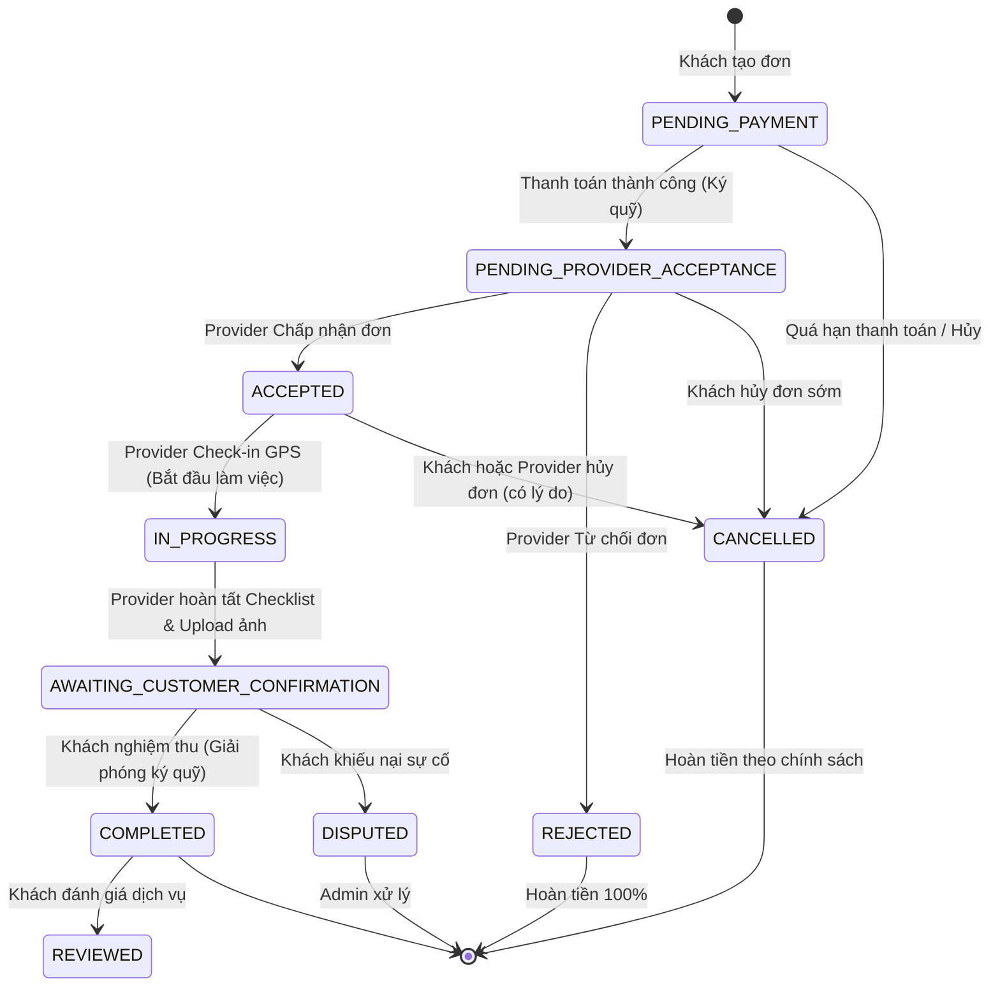

# TÀI LIỆU PHÂN TÍCH & KẾ HOẠCH BỔ SUNG LUỒNG BOOKING (END-TO-END)
**Dự án:** PET_LOVE (Web Frontend, Backend NestJS, Mobile Expo)  
**Ngày lập:** 24/09/2026  
**Trạng thái:** Kế hoạch triển khai màn hình Mobile & đồng bộ Web/Backend

---

## 1. TỔNG QUAN HIỆN TRẠNG LUỒNG BOOKING

Hệ thống **Backend** đã phát triển đầy đủ các use-case cho toàn bộ vòng đời của một cuốc đặt lịch (từ báo giá, tạo đơn, đối tác nhận/từ chối, check-in GPS, tích checklist, chụp ảnh minh chứng, đến khách nghiệm thu, đánh giá và khiếu nại). 

Trên **Web Frontend**, cả luồng của Customer lẫn Provider đều đã được xây dựng. Tuy nhiên, trên ứng dụng **Mobile**, hiện tại mới chỉ có luồng đặt lịch sơ khởi của phía **Customer** (chưa có theo dõi chi tiết sau đặt), trong khi phía **Provider** hoàn toàn chưa có giao diện thực thi cuốc làm việc (màn hình `ProviderScreen.tsx` hiện chỉ là placeholder).

### Bảng so sánh tính năng giữa các nền tảng:

| Giai đoạn luồng Booking | Backend API | Web Frontend | Mobile App |
| :--- | :---: | :---: | :---: |
| **1. Khách chọn dịch vụ, thú cưng, đối tác, giờ hẹn** | ✅ Đầy đủ | ✅ Đầy đủ | ✅ Đã có |
| **2. Báo giá, áp mã giảm giá, tính phí di chuyển** | ✅ Đầy đủ | ✅ Đầy đủ | ✅ Đã có |
| **3. Thanh toán (Ví / Ký quỹ / VietQR / VNPay)** | ✅ Đầy đủ | ✅ Đầy đủ | ✅ Đã có |
| **4. Provider nhận/từ chối cuốc hẹn** | ✅ Đầy đủ | ✅ Đã có | ❌ **Chưa có** |
| **5. Provider Check-in GPS tại nhà khách** | ✅ Đầy đủ | ✅ Đã có | ❌ **Chưa có** |
| **6. Provider tích Checklist công việc từng bước** | ✅ Đầy đủ | ✅ Đã có | ❌ **Chưa có** |
| **7. Provider chụp ảnh minh chứng & Bàn giao** | ✅ Đầy đủ | ✅ Đã có | ❌ **Chưa có** |
| **8. Khách theo dõi tiến độ thời gian thực** | ✅ Đầy đủ | ✅ Đã có | ❌ **Chưa có** |
| **9. Khách nghiệm thu & giải phóng ký quỹ** | ✅ Đầy đủ | ✅ Đã có | ❌ **Chưa có** |
| **10. Khách đánh giá sao & nhận xét (Review)** | ✅ Đầy đủ | ✅ Đã có | ❌ **Chưa có** |
| **11. Mở khiếu nại / Báo cáo sự cố (Dispute)** | ✅ Đầy đủ | ✅ Đã có | ❌ **Chưa có** |
| **12. Provider quản lý & đăng ký lịch rảnh/bận** | ✅ Đầy đủ | ✅ Đã có | ❌ **Chưa có** |

---

## 2. STATE MACHINE (VÒNG ĐỜI TRẠNG THÁI ĐƠN HÀNG)

---

## 3. ĐẶC TẢ CHI TIẾT CÁC MÀN HÌNH CẦN BỔ SUNG

### PHẦN I: CÁC MÀN HÌNH DÀNH CHO PROVIDER (ĐỐI TÁC DỊCH VỤ)

#### Màn hình P1: Quản lý danh sách đơn hàng (`ProviderBookingListScreen`)
* **Nhiệm vụ chính:** Giúp Provider nắm bắt toàn bộ các lịch hẹn được giao theo thời gian thực với phân loại trạng thái rõ ràng.
* **Các Tab hiển thị:**
  * `Chờ tiếp nhận`: Các đơn khách vừa đặt chờ Provider bấm nhận.
  * `Sắp tới`: Các đơn đã nhận (`ACCEPTED`), chuẩn bị di chuyển đến làm.
  * `Đang làm`: Đơn đang diễn ra (`IN_PROGRESS`).
  * `Lịch sử`: Đơn đã hoàn tất (`COMPLETED`) hoặc đã hủy (`CANCELLED`/`REJECTED`).
* **Dữ liệu hiển thị (Output):**
  * Bảng `bookings`: `id`, `status`, `requested_date`, `estimated_start_at`, `estimated_end_at`, `total_price`.
  * Bảng `users` (Khách hàng): `fullName`, `phone`, `avatarUrl`.
  * Bảng `customer_addresses`: `address_line`, `ward`, `district`, `city`, khoảng cách ước tính.
  * Bảng `booking_pets` & `pets`: `name`, `species`, `breed`, `weight`, `avatar_url`.
  * Bảng `services`: Tên gói dịch vụ (`name`), thời lượng (`duration_minutes`).
* **API Backend:** `GET /bookings?role=PROVIDER&status=...`

---

#### Màn hình P2: Chi tiết đơn & Tiếp nhận/Từ chối (`ProviderBookingActionDetailScreen`)
* **Nhiệm vụ chính:** Xem chi tiết toàn diện của cuốc hẹn trước khi quyết định nhận cuốc hoặc chuẩn bị dụng cụ.
* **Dữ liệu hiển thị (Output):**
  * Bảng `bookings`: Thông tin thời gian slot, mã đơn hàng, ghi chú khách (`customer_note`), thu nhập Provider nhận được (`payments.provider_amount`).
  * Bảng `customer_addresses`: Địa chỉ chi tiết, toạ độ GPS (`latitude`, `longitude`).
  * Bảng `pets`: Thông tin y tế và tâm lý thú cưng (`health_note`, `behavior_note`, `weight`, `gender`).
* **Dữ liệu nhập & Hành động (Input):**
  * **Nút Chấp nhận (Accept):** Gọi `POST /bookings/:id/provider-accept` -> Cập nhật `bookings.status = ACCEPTED`, `accepted_at = NOW()`.
  * **Nút Từ chối (Reject):** Gọi `POST /bookings/:id/provider-reject` -> Cập nhật `bookings.status = REJECTED`, trả lại slot trống.
  * **Nút Hủy đơn khẩn cấp (Cancel):** Nhập lý do (`dto.reason`) -> Gọi `POST /bookings/:id/provider-cancel` -> Ghi log vào `booking_cancellations`.
  * **Nút Nhắn tin / Gọi điện:** Mở phòng chat liên kết với khách qua `chat_rooms`.

---

#### Màn hình P3: Thực hiện công việc: Check-in GPS & Checklist & Bàn giao (`ProviderServiceExecutionScreen`)
* **Nhiệm vụ chính:** Đảm bảo quy trình làm việc chuẩn mực, minh bạch có định vị và hình ảnh trước/sau dịch vụ.
* **Giai đoạn 1: Check-in GPS (Bắt đầu làm việc)**
  * **Hành động:** Provider bấm "Xác nhận Check-in GPS". Ứng dụng lấy toạ độ vị trí hiện tại của thiết bị di động.
  * **Input gửi đi:** `POST /bookings/:id/start-service` với body `{ latitude, longitude, note, checkinPhotoUrl? }`.
  * **Database cập nhật:** `bookings.status = IN_PROGRESS`, `bookings.started_at = NOW()`.
* **Giai đoạn 2: Tích chọn Checklist công việc (`booking_checklist_items`)**
  * **Output hiển thị:** Danh sách các đầu việc theo dịch vụ từ bảng `booking_checklist_items` (kế thừa từ `service_checklist_templates`).
  * **Input thao tác:** Tích chọn từng việc hoặc chọn hàng loạt.
  * **API & Database:**
    * Gọi `PATCH /bookings/:id/checklist/:itemId` với `{ status: 'DONE' | 'PENDING' }`.
    * Hoặc gọi `PATCH /bookings/:id/checklist/batch`.
    * Cập nhật `booking_checklist_items.status`, `completed_at`.
* **Giai đoạn 3: Chụp ảnh minh chứng nghiệm thu (Evidence Upload)**
  * **Input thao tác:** Chụp ảnh thú cưng sau khi chăm sóc xong bằng camera.
  * **API & Database:**
    * Gọi `POST /bookings/:id/evidence-upload` (Multipart form-data).
    * Backend lưu file vào storage và tạo bản ghi trong `booking_media` (`booking_id`, `media_url`, `media_type = IMAGE`, `uploaded_by`).
* **Giai đoạn 4: Hoàn thành & Yêu cầu nghiệm thu**
  * **Hành động:** Sau khi checklist hoàn thành 100% và đã có ảnh nghiệm thu, nút "Hoàn thành dịch vụ" được kích hoạt.
  * **API & Database:** Gọi `POST /bookings/:id/complete` với `{ evidenceMedias: [...] }` -> Cập nhật `bookings.status = AWAITING_CUSTOMER_CONFIRMATION` hoặc `COMPLETED`.

---

#### Màn hình P4: Đăng ký & Quản lý lịch làm việc Provider (`ProviderScheduleScreen`)
* **Nhiệm vụ chính:** Provider chủ động thiết lập khung giờ nhận việc trong tuần, khóa các ca bận đột xuất để không bị khách đặt đè lịch.
* **Dữ liệu hiển thị (Output):**
  * Ma trận lịch tuần (Thứ 2 đến Chủ Nhật) chia theo ca sáng/chiều/tối.
  * Trạng thái từng slot: `AVAILABLE` (Đang mở đón khách), `BOOKED` (Đã có khách đặt), `BLOCKED` (Đang khóa/Nghỉ).
  * Bảng liên quan: `provider_working_slots`, `provider_working_days`, `provider_availability`.
* **Dữ liệu nhập & Hành động (Input):**
  * **Cập nhật lịch tuần:** Chọn ngày, giờ bắt đầu (`start_time`), giờ kết thúc (`end_time`) -> Gọi `POST /provider-schedules` (Body: `UpdateProviderScheduleDto`).
  * **Khóa slot khẩn cấp:** Bấm vào một slot rảnh -> Chọn khóa -> Gọi `PUT /provider-schedules/slots/:slotId/block`.
  * **Sao chép lịch tuần (Copy Week):** Chọn sao chép từ tuần trước sang tuần sau -> Gọi `POST /provider-schedules/copy-week`.

---

### PHẦN II: CÁC MÀN HÌNH BỔ SUNG DÀNH CHO CUSTOMER (NGƯỜI DÙNG)

#### Màn hình C1: Chi tiết đơn hàng & Theo dõi tiến độ (`CustomerBookingDetailScreen`)
* **Nhiệm vụ chính:** Cung cấp cho khách hàng màn hình tracking toàn diện thay vì chỉ xem danh sách tóm tắt.
* **Dữ liệu hiển thị (Output):**
  * **Trục tiến độ (Progress Timeline):** Đã đặt -> Đã có thợ nhận -> Thợ đã check-in tại nhà -> Đang làm dịch vụ -> Đang chờ nghiệm thu -> Hoàn tất.
  * **Xem ảnh trực tiếp:** Hiển thị ảnh minh chứng check-in và ảnh hoàn thành do thợ vừa chụp tải lên từ bảng `booking_media`.
  * **Thông tin thợ:** Họ tên, avatar, số sao đánh giá, số điện thoại, nút chat nhanh.
  * **Chi tiết hóa đơn:** Giá dịch vụ, chiết khấu khuyến mại, phụ phí di chuyển, tổng tiền đã ký quỹ.
* **Hành động & Dữ liệu nhập (Input):**
  * **Nút Xác nhận nghiệm thu:** Khách hài lòng bấm "Xác nhận hoàn thành" -> Gọi `POST /bookings/:id/customer-confirm` -> Cập nhật `bookings.status = COMPLETED`, tự động giải phóng tiền ký quỹ chuyển về ví của Provider.
  * **Nút Khiếu nại:** Chuyển sang màn hình Báo cáo sự cố nếu có vấn đề.
  * **Nút Hủy đơn:** Nhập lý do hủy -> Gọi `POST /bookings/:id/cancel`.

---

#### Màn hình C2: Đánh giá & Chấm điểm dịch vụ (`CustomerReviewScreen`)
* **Nhiệm vụ chính:** Cho phép khách đánh giá chất lượng tay nghề và thái độ phục vụ của đối tác sau khi cuốc hoàn tất.
* **Dữ liệu nhập vào (Input):**
  * Số sao đánh giá: `rating` (1 - 5 sao).
  * Lời nhận xét: `comment` (text).
  * Ảnh chụp thực tế thú cưng sau khi được làm đẹp/chăm sóc: Upload vào `review_media`.
* **API & Database:**
  * Gọi API `POST /bookings/:id/reviews` (Body: `CreateReviewDto`).
  * Lưu vào bảng `reviews` (`booking_id`, `reviewer_id`, `reviewee_id`, `rating`, `comment`).
  * Backend tự động cập nhật lại `rating_avg` và `total_reviews` trong bảng `provider_profiles`.

---

#### Màn hình C3: Báo cáo sự cố / Khiếu nại dịch vụ (`DisputeComplaintScreen`)
* **Nhiệm vụ chính:** Xử lý khi có phát sinh tranh chấp hoặc sự cố (thú cưng bị thương, thợ làm ẩu, thợ không đến).
* **Dữ liệu nhập vào (Input):**
  * Tiêu đề khiếu nại: `title` (text).
  * Lý do: `reason` (enum: `PET_INJURY`, `POOR_SERVICE`, `NO_SHOW`, `DAMAGE_PROPERTY`, ...).
  * Mô tả sự việc: `description` (text).
  * Minh chứng hình ảnh/video: Upload đính kèm vào `complaint_evidences`.
* **API & Database:**
  * Gọi API `POST /bookings/:id/dispute` (Body: `OpenDisputeDto`).
  * Lưu vào bảng `complaints` (`booking_id`, `complainant_id`, `title`, `description`, `reason`, `status = OPEN`).
  * Backend kích hoạt thông báo cho Admin Core vào điều tra và xử lý hoàn tiền hoặc bồi thường.

---

## 4. BẢNG TỔNG HỢP MÀN HÌNH, API VÀ BẢNG DATABASE LIÊN QUAN

| STT | Tên màn hình | Đối tượng | API Endpoint Backend | Các bảng Database chính |
| :---: | :--- | :---: | :--- | :--- |
| **1** | `ProviderBookingListScreen` | Provider | `GET /bookings` | `bookings`, `users`, `pets`, `services`, `customer_addresses` |
| **2** | `ProviderBookingActionDetailScreen` | Provider | `GET /bookings/:id` `POST /bookings/:id/provider-accept` `POST /bookings/:id/provider-reject` `POST /bookings/:id/provider-cancel` | `bookings`, `booking_cancellations`, `payments`, `pets`, `customer_addresses` |
| **3** | `ProviderServiceExecutionScreen` | Provider | `POST /bookings/:id/start-service` `GET /bookings/:id/checklist` `PATCH /bookings/:id/checklist/:itemId` `POST /bookings/:id/evidence-upload` `POST /bookings/:id/complete` | `bookings`, `booking_checklist_items`, `booking_media`, `booking_status_logs` |
| **4** | `ProviderScheduleScreen` | Provider | `GET /provider-schedules` `POST /provider-schedules` `PUT /provider-schedules/slots/:slotId/block` `POST /provider-schedules/copy-week` | `provider_working_slots`, `provider_working_days`, `provider_availability` |
| **5** | `CustomerBookingDetailScreen` | Customer | `GET /bookings/:id` `POST /bookings/:id/customer-confirm` `POST /bookings/:id/cancel` | `bookings`, `booking_media`, `provider_profiles`, `payments` |
| **6** | `CustomerReviewScreen` | Customer | `POST /bookings/:id/reviews` | `reviews`, `review_media`, `provider_profiles` |
| **7** | `DisputeComplaintScreen` | Khách / Thợ | `POST /bookings/:id/dispute` | `complaints`, `complaint_evidences` |

---

## 5. LỘ TRÌNH TRIỂN KHAI ĐỀ XUẤT (IMPLEMENTATION ROADMAP)

### Giai đoạn 1: Màn hình Vận hành cơ bản của Provider (Cốt lõi)
1. Xây dựng `mobile/src/features/provider/screens/ProviderBookingListScreen.tsx` (Danh sách đơn chia tab).
2. Xây dựng `mobile/src/features/provider/screens/ProviderBookingActionDetailScreen.tsx` (Xem chi tiết + Nút Nhận/Từ chối cuốc).
3. Đăng ký điều hướng (Navigation Routes) trong `mobile/app/(provider)`.

### Giai đoạn 2: Màn hình Thực thi công việc (Check-in & Checklist)
1. Tích hợp thư viện định vị `expo-location` để lấy toạ độ thực tế của Provider.
2. Xây dựng màn hình `ProviderServiceExecutionScreen.tsx`:
   * Nút Check-in GPS chuyển đơn sang `IN_PROGRESS`.
   * Giao diện Checklist đầu việc tương tác mượt mà.
   * Component chụp ảnh bằng camera (`expo-image-picker`) và upload minh chứng qua API `/bookings/:id/evidence-upload`.
   * Nút Hoàn thành cuốc chăm sóc.

### Giai đoạn 3: Hoàn thiện vòng lặp phía Khách hàng
1. Xây dựng `CustomerBookingDetailScreen.tsx` trong `mobile/src/features/bookings/screens/` để khách theo dõi trạng thái realtime và xem ảnh minh chứng.
2. Thêm nút "Xác nhận nghiệm thu" (`customer-confirm`) để mở khóa tiền ký quỹ cho thợ.
3. Xây dựng `CustomerReviewScreen.tsx` để khách chấm sao và gửi nhận xét.

### Giai đoạn 4: Quản lý ca làm việc (Schedule Management)
1. Xây dựng `ProviderScheduleScreen.tsx` hiển thị lịch tuần và các slot rảnh/bận.
2. Bổ sung tính năng bật/tắt nhận ca, tạm khóa ca bận và sao chép lịch làm việc.
