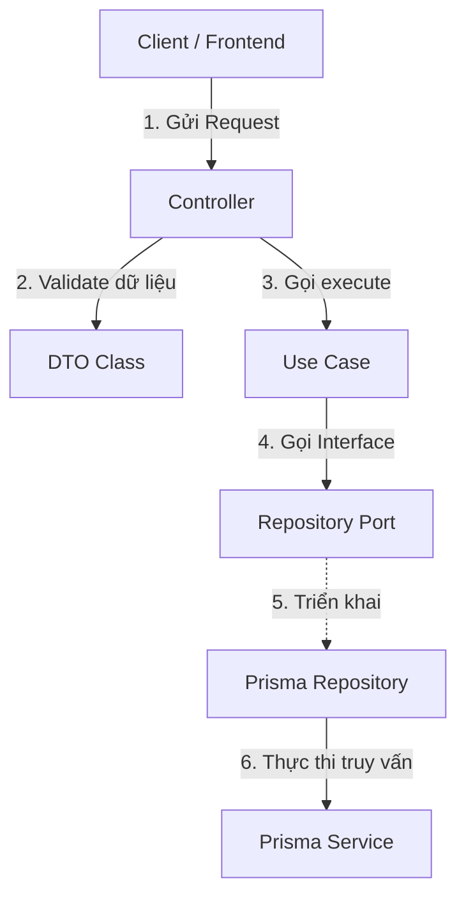

# PET_CARE API Design & Architecture Guideline

Tài liệu này quy định các tiêu chuẩn thiết kế API, cách tổ chức/tách file nghiệp vụ và luồng phối hợp hoạt động giữa các thành phần trong NestJS backend của dự án PET_CARE. Mọi thành viên phát triển đều phải tuân thủ nghiêm ngặt các quy định dưới đây để giữ cho codebase đồng bộ và dễ bảo trì.

---

## 1. Nguyên Tắc Thiết Kế API Chung

### 1.1. HTTP Methods & Định Dạng Route
*   **Danh từ số nhiều (Plural Nouns):** URL của resource phải dùng danh từ số nhiều.
    *   *Đúng:* `/api/bookings`, `/api/pets`
    *   *Sai:* `/api/booking`, `/api/add-pet`
*   **Định dạng chữ thường và phân cách bằng dấu gạch ngang (kebab-case):**
    *   *Ví dụ:* `/api/provider-profiles`, `/api/service-checklist-templates`
*   **Áp dụng đúng HTTP Methods cho từng hành động:**
    *   `GET`: Truy vấn thông tin (không làm thay đổi trạng thái hệ thống).
    *   `POST`: Tạo mới tài nguyên hoặc kích hoạt một luồng xử lý phức tạp (như thanh toán, gửi OTP).
    *   `PUT`: Cập nhật toàn bộ tài nguyên (hoặc thay thế).
    *   `PATCH`: Cập nhật một phần tài nguyên (thường dùng nhiều nhất trong thực tế).
    *   `DELETE`: Xóa tài nguyên (ưu tiên Soft Delete/Archive nếu là dữ liệu nghiệp vụ quan trọng).

### 1.2. HTTP Status Codes chuẩn
*   `200 OK`: Khi các phương thức `GET`, `PUT`, `PATCH`, `DELETE` thực thi thành công.
*   `201 Created`: Khi phương thức `POST` tạo mới tài nguyên thành công.
*   `400 Bad Request`: Validation lỗi ở lớp DTO (ví dụ: thiếu trường bắt buộc, sai định dạng email).
*   `401 Unauthorized`: Khi không truyền JWT Token hoặc JWT Token không hợp lệ/hết hạn.
*   `403 Forbidden`: Đã xác thực thành công nhưng không có vai trò phù hợp (Role Guard) hoặc không có quyền sở hữu tài nguyên cần truy cập.
*   `404 Not Found`: Tài nguyên yêu cầu không tồn tại trong cơ sở dữ liệu.
*   `409 Conflict`: Xung đột dữ liệu nghiệp vụ (ví dụ: Email đã được đăng ký, lịch chăm sóc trùng giờ).
*   `500 Internal Server Error`: Lỗi phát sinh ngoài ý muốn từ phía Server (luôn ghi kèm Request ID vào file log).

### 1.3. Định dạng dữ liệu phản hồi (Response Shape)
Tất cả các API cần được bọc đồng nhất qua `TransformInterceptor`. Khi trả về một đối tượng hoặc danh sách, hãy giữ chúng gọn gàng:
*   **Response đơn lẻ (Single Object):**
    ```json
    {
      "id": "e229e62f-f463-4b68-b80c-7b4700d1109a",
      "fullName": "Nguyen Van A",
      "email": "customer@petcare.com"
    }
    ```
*   **Response danh sách (Pagination / List):**
    ```json
    {
      "data": [
        { "id": "uuid-1", "name": "Cho Shiba" },
        { "id": "uuid-2", "name": "Meo Anh" }
      ],
      "meta": {
        "total": 20,
        "page": 1,
        "limit": 10,
        "totalPages": 2
      }
    }
    ```

---

## 2. Quy Tắc Tách File Nghiệp Vụ (File Separation Rules)

Mỗi module nghiệp vụ (trừ các module legacy/facade đơn giản như `users` và một phần của `auth`) được cấu trúc thành các lớp cô lập, có ranh giới rõ ràng. Dưới đây là cách tách file trong thư mục `src/modules/<feature>/`:



### 2.1. Lớp Presentation & HTTP Interfaces (Controller & DTO)
*   **`<feature>.controller.ts`**:
    *   *Nhiệm vụ:* Định nghĩa endpoints, phân quyền truy cập (`@UseGuards`), thiết lập mô tả API Docs (`@ApiTags`, `@ApiOperation`).
    *   *Quy tắc:* **Không** chứa logic nghiệp vụ hay truy vấn DB. Chỉ nhận dữ liệu từ request, giải mã thông tin user từ JWT (sử dụng decorator `@GetCurrentUserId()`), và chuyển tiếp đầu vào cho Use Case.
*   **`dto/*.dto.ts`**:
    *   *Nhiệm vụ:* Định nghĩa kiểu dữ liệu truyền qua HTTP (Request Body, Query Params).
    *   *Quy tắc:* Sử dụng các decorator của `class-validator` (như `@IsString()`, `@IsEmail()`, `@IsOptional()`) để NestJS tự động validate ở cửa ngõ.

### 2.2. Lớp Nghiệp Vụ Ứng Dụng (Application Layer)
Lớp này nằm trong thư mục `application/` và hoàn toàn độc lập với các thư viện bên ngoài hay framework HTTP.
*   **`application/use-cases/<action>-<feature>.use-case.ts`**:
    *   *Nhiệm vụ:* Chứa logic nghiệp vụ cốt lõi cho một hành động duy nhất (Single Responsibility).
    *   *Ví dụ:* `create-booking.use-case.ts`, `verify-email-otp.use-case.ts`.
    *   *Quy tắc:* Nhận tham số đầu vào là plain TypeScript type/interface, thực thi các kiểm tra nghiệp vụ (quyền sở hữu, thời gian hợp lệ), gọi qua Port (Repository Interface) để lưu trữ và trả về kết quả. Cấm import `@nestjs/common`, `PrismaService` hay bất kỳ DTO nào tại đây.
*   **`application/ports/<feature>.repository.port.ts`**:
    *   *Nhiệm vụ:* Định nghĩa interface để quy ước các hàm tương tác cơ sở dữ liệu mà Use Case cần dùng.
    *   *Quy tắc:* Chỉ chứa khai báo kiểu dữ liệu (TypeScript Interface), không có dòng code thực thi nào.
*   **`application/types/<feature>.types.ts`**:
    *   *Nhiệm vụ:* Định nghĩa các kiểu dữ liệu nội bộ (Plain TS Types) dùng để truyền dữ liệu giữa Controller, Use Case và Repository.

### 2.3. Lớp Hạ Tầng & Kết Nối Dữ Liệu (Infrastructure Layer)
Lớp này nằm trong thư mục `infrastructure/` và phụ thuộc vào cơ sở dữ liệu.
*   **`infrastructure/persistence/prisma-<feature>.repository.ts`**:
    *   *Nhiệm vụ:* Thực thi các phương thức dữ liệu được khai báo trong Port bằng cách gọi qua `PrismaService`.
    *   *Quy tắc:* Đây là nơi duy nhất chứa các câu lệnh `this.prisma.model.findUnique`, `this.prisma.model.create`, v.v.

### 2.4. DI Tokens & NestJS Module
*   **`<feature>.tokens.ts`**:
    *   *Nhiệm vụ:* Khai báo Symbol DI Token để thay thế Interface lúc NestJS chạy chương trình.
    *   *Ví dụ:* `export const PET_REPOSITORY = Symbol('PET_REPOSITORY');`
*   **`<feature>.module.ts`**:
    *   *Nhiệm vụ:* Đăng ký Controller, liên kết Repository thực thi với DI Token, cung cấp các Use Case cho NestJS container quản lý.
    *   *Ví dụ đăng ký Repository:*
        ```typescript
        {
          provide: PET_REPOSITORY,
          useClass: PrismaPetRepository,
        }
        ```

---

## 3. Cách Thức Phối Hợp Giữa Các File (Luồng Code Chi Tiết)

Để hình dung cách các file này phối hợp với nhau, chúng ta sẽ lấy ví dụ về nghiệp vụ **Tạo mới thú cưng (Create Pet)**.

### Bước 1: Khai báo Token (`pets.tokens.ts`)
```typescript
// src/modules/pets/pets.tokens.ts
export const PET_REPOSITORY = Symbol('PET_REPOSITORY');
```

### Bước 2: Khai báo Port (`pets.repository.port.ts`)
```typescript
// src/modules/pets/application/ports/pets.repository.port.ts
import { PetRecord, CreatePetInput } from '../types/pets.types';

export interface PetRepositoryPort {
  create(data: CreatePetInput): Promise<PetRecord>;
  findByNameAndOwner(name: string, ownerId: string): Promise<PetRecord | null>;
}
```

### Bước 3: Tạo Use Case (`create-pet.use-case.ts`)
```typescript
// src/modules/pets/application/use-cases/create-pet.use-case.ts
import { Injectable, Inject, ConflictException } from '@nestjs/common';
import { PET_REPOSITORY } from '../../pets.tokens';
import { PetRepositoryPort } from '../ports/pets.repository.port';
import { CreatePetInput, PetRecord } from '../types/pets.types';

@Injectable()
export class CreatePetUseCase {
  constructor(
    @Inject(PET_REPOSITORY)
    private readonly petRepository: PetRepositoryPort,
  ) {}

  async execute(input: CreatePetInput): Promise<PetRecord> {
    // 1. Kiểm tra nghiệp vụ: Tên thú cưng của chủ này đã tồn tại chưa?
    const existing = await this.petRepository.findByNameAndOwner(input.name, input.ownerId);
    if (existing) {
      throw new ConflictException('Thú cưng với tên này đã tồn tại trong tài khoản của bạn.');
    }

    // 2. Gọi Port để lưu xuống cơ sở dữ liệu
    return this.petRepository.create(input);
  }
}
```

### Bước 4: Tạo Controller (`pets.controller.ts`)
```typescript
// src/modules/pets/pets.controller.ts
import { Controller, Post, Body } from '@nestjs/common';
import { ApiTags, ApiOperation, ApiBearerAuth } from '@nestjs/swagger';
import { GetCurrentUserId } from '../../common/decorators/get-current-user-id.decorator';
import { CreatePetDto } from './dto/create-pet.dto';
import { CreatePetUseCase } from './application/use-cases/create-pet.use-case';

@ApiTags('Pets')
@ApiBearerAuth()
@Controller('pets')
export class PetsController {
  constructor(private readonly createPetUseCase: CreatePetUseCase) {}

  @Post()
  @ApiOperation({ summary: 'Tạo hồ sơ thú cưng mới' })
  async create(
    @GetCurrentUserId() userId: string, // Lấy an toàn từ JWT Token
    @Body() dto: CreatePetDto,          // Tự động validate bằng ValidationPipe
  ) {
    return this.createPetUseCase.execute({
      ownerId: userId,
      name: dto.name,
      species: dto.species,
      breed: dto.breed,
      age: dto.age,
    });
  }
}
```

### Bước 5: Triển khai Repository thực tế (`prisma-pets.repository.ts`)
```typescript
// src/modules/pets/infrastructure/persistence/prisma-pets.repository.ts
import { Injectable } from '@nestjs/common';
import { PrismaService } from '../../../database/prisma.service';
import { PetRepositoryPort } from '../../application/ports/pets.repository.port';
import { CreatePetInput, PetRecord } from '../../application/types/pets.types';

@Injectable()
export class PrismaPetsRepository implements PetRepositoryPort {
  constructor(private readonly prisma: PrismaService) {}

  async findByNameAndOwner(name: string, ownerId: string): Promise<PetRecord | null> {
    return this.prisma.pets.findFirst({
      where: {
        name,
        customer_id: ownerId,
      },
    });
  }

  async create(data: CreatePetInput): Promise<PetRecord> {
    return this.prisma.pets.create({
      data: {
        name: data.name,
        species: data.species,
        breed: data.breed,
        age: data.age,
        customer_id: data.ownerId,
      },
    });
  }
}
```

### Bước 6: Khai báo liên kết trong Module (`pets.module.ts`)
```typescript
// src/modules/pets/pets.module.ts
import { Module } from '@nestjs/common';
import { PrismaModule } from '../../database/prisma.module';
import { PetsController } from './pets.controller';
import { CreatePetUseCase } from './application/use-cases/create-pet.use-case';
import { PET_REPOSITORY } from './pets.tokens';
import { PrismaPetsRepository } from './infrastructure/persistence/prisma-pets.repository';

@Module({
  imports: [PrismaModule],
  controllers: [PetsController],
  providers: [
    CreatePetUseCase,
    {
      provide: PET_REPOSITORY,
      useClass: PrismaPetsRepository,
    },
  ],
  exports: [],
})
export class PetsModule {}
```

---

## 4. Checklist Khi Thiết Kế API Mới

Trước khi gửi Pull Request hoặc hoàn thành một API mới, hãy tự kiểm tra danh sách sau:

> [!NOTE]
> *   [ ] Đường dẫn API đã sử dụng danh từ số nhiều và ở định dạng kebab-case chưa?
> *   [ ] Đã cấu hình các validation decorator (như `@IsNotEmpty`, `@IsEmail`) trong DTO đầy đủ chưa?
> *   [ ] Có gọi trực tiếp `PrismaService` trong Controller hoặc Use Case không? (Phải đảm bảo là **KHÔNG**).
> *   [ ] Dữ liệu định danh user (`userId`/`ownerId`) được lấy từ Token JWT hay Client truyền lên? (Phải lấy từ **JWT**).
> *   [ ] Đã định nghĩa Port (Interface) cho các tương tác database và liên kết qua `Symbol` Token chưa?
> *   [ ] Đã cấu hình các Swagger Decorator cho API (`@ApiTags`, `@ApiOperation`, `@ApiResponse`) để hiển thị đẹp trên Swagger UI chưa?
> *   [ ] Use Case nghiệp vụ quan trọng đã được viết Unit Test để kiểm tra logic chạy thành công và thất bại chưa?
